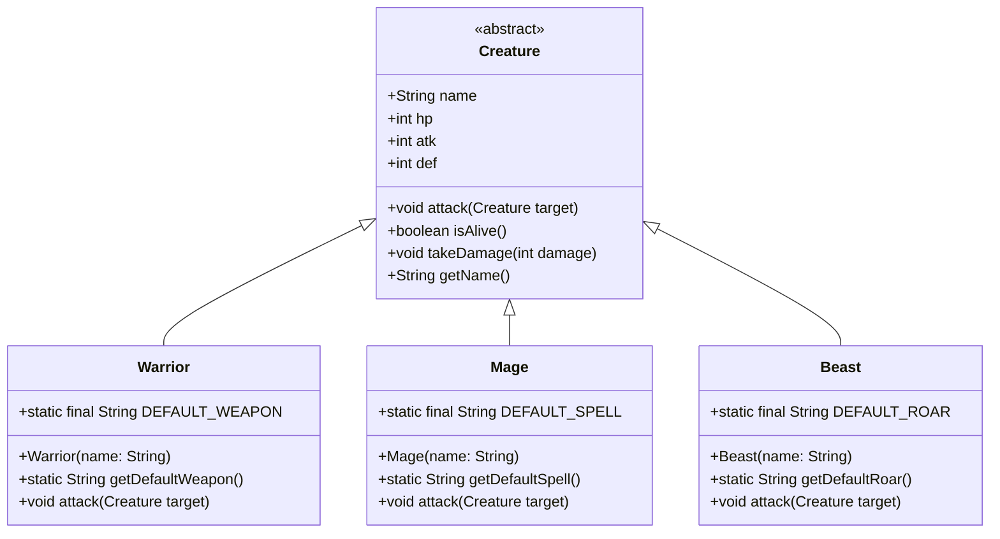

```mermaid
classDiagram
    class Creature {
        <<abstract>>
        +String name
        +int hp
        +int atk
        +int def
        +void attack(Creature target)
        +boolean isAlive()
        +void takeDamage(int damage)
        +String getName()
    }

    class Warrior {
        +static final String DEFAULT_WEAPON
        +Warrior(name: String)
        +static String getDefaultWeapon()
        +void attack(Creature target)
    }

    class Mage {
        +static final String DEFAULT_SPELL
        +Mage(name: String)
        +static String getDefaultSpell()
        +void attack(Creature target)
    }

    class Beast {
        +static final String DEFAULT_ROAR
        +Beast(name: String)
        +static String getDefaultRoar()
        +void attack(Creature target)
    }

    Creature <|-- Warrior
    Creature <|-- Mage
    Creature <|-- Beast
```
